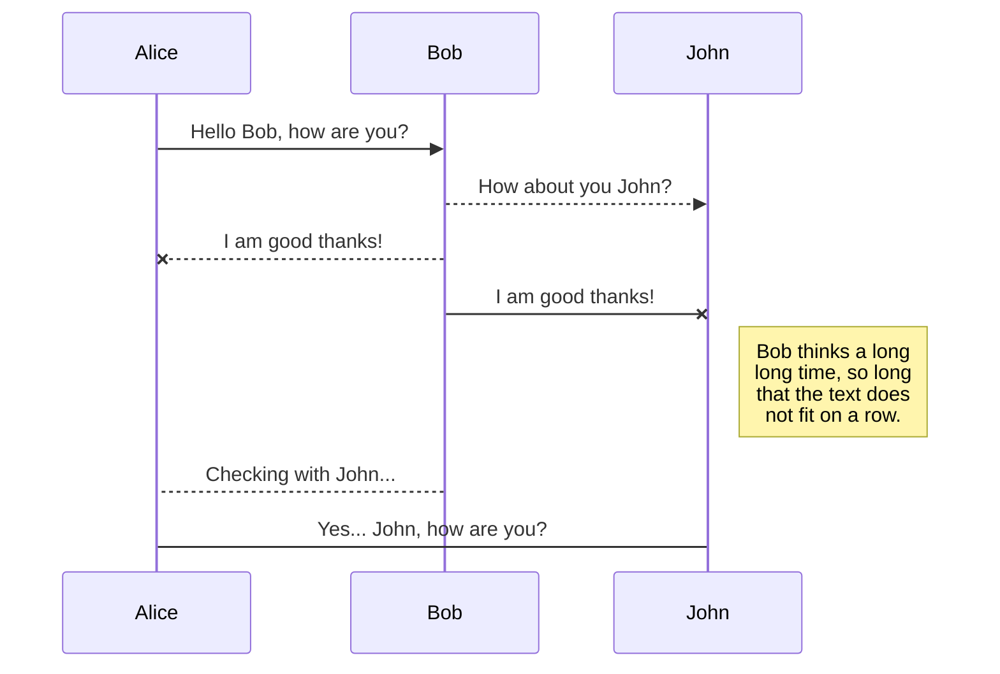
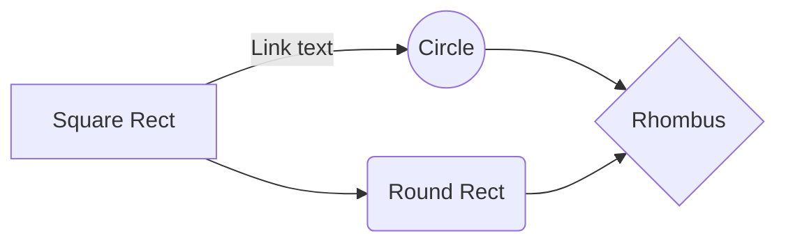

---
title: "Second"
date: 2018-05-04T22:47:33+05:00
draft: false
---

# Introduction to Databases
These notes are inspired from the [Lecture 18](https://www.youtube.com/watch?v=Pk1E3Iod7eQ&list=PLRdybCcWDFzCag9A0h1m9QYaujD0xefgM&index=17) and [Lecture 19](https://www.youtube.com/watch?v=DRGr3tFtHiQ&list=PLRdybCcWDFzCag9A0h1m9QYaujD0xefgM&index=18) of UC Berkely's CS162 Operating System course along with some additional resources from internet. I'll try to provide (collect) all references at the end of this post. This post is intended as *scratch pad* for my future self and may not help anyone else much; though the lecture video I linked earlier should definitely help you if you are looking for a Databases Introduction.

## What is a database?
First of all, database is a collection of **code** files i.e. coding and databases are not two distinct concepts (to my younger self). Informally, a database can be described as a collection of code files that provide an interface to interact with data quickly and reliably i.e. instead of replicating (and managing) data-handling code in your program, you can call a library to handle (store, retrieve, retrieve-a-special-subset-of-data; aka a query) data related operations for you. That imported library will provide an interface (higher level calling semantics; function calls etc) to do the operations.

Formally, [John Canny](https://www2.eecs.berkeley.edu/Faculty/Homepages/canny.html) in his lecture has defined a Database as follwoing:

> A large **integrated collection** of data which models the real world entities and (potnetially) the relationships between those entities  e.g. Entities (teams, games etc) Relationships (played-*the-game*, memebr-of-team etc)

For example, Cal (an entity) plays against (a relationship) Stanford (another entity) in (another relationship) The Big Game (yet another entity).


## How different organizations are using databases?

Organization|DB Size                    | Usage |Desing Constraints       | Keywords | Recommended DB types
------------|---------------------------|-------|-------------------------|----------|---------------------
Yahoo       |`700 TB`                   | matching advertisers with users/consumers |higly available; millions of active users at any given time; service (ad) should be provided, accuracy/quality is secondary | Timeliness, Availability | BASE 
AT&T        |`330 TB`            | managing users data, bills, usage etc. Should a user be allowed to make the call or should be routed to "insufficient balance" message |a user should not be charged for what he/she didn't consume and at the same time should be charged for each text message or internet MB he/she consumed. A (wireless) client can change it's location, can fly to another city or even another country.| Accuracy, Consistency, Durability| ACID 
Austrailian Bureaue of Statistics|`250 TB`| |many queries with big results e.g. how many people are ther in Melbourne region who are younger than 25 years, have a graduate degree and work in Tech secotr. Ability to go through TBs of data in short amount of time. | Fast, Rich Queries| OLAP, ROLAP 


## What is "structured data"?
A data model is a collection of entities and their relationships.

A schema is an instance of a data model. It describes the fields in the database; how the database is organized.

A relational database is the most used data model. Example of  relation include tables with rows and columns. Every relation has a schema which describes the fields in the column.

### Example: A university's database
#### Conceptual Schema

- A university has **students**
- Some **classes** are offered by the university
- **Students enroll in classes** 

In a database all these three conceptual items will be modeled as three tables:

- **Student Table** 
`(student_id:string, name:string, email:string, age:int, gpa:float)` 

- **Courses Table** 
`(course_id:string, name:string, credit_hours:int)` 

- **Enrolled Table** 
```python
( concatenate(course_id:string, student_id:string), gpa:float)
 		FOREIGN KEY student_id REFERENCES(is from) Students(table)
 		FOREIGN KEY course_id  REFERENCES(is from) Courses(table)
```


`concatenate(course_id:string, student_id:string)` in last table is calles a **Composite Key**.

The last two lines in *Enrolled* table are **constraints** on the table items.

#### External Schema (View)
A View is a virtual table which does not exist as a *real* table in DB but instead is formed as a result of queries and some data operations on the results of queries. For example if you want to create an **Enrollment** table, which is a required information in a university so that instructors and admisntrators can view (know) how many students are enrolled in different courses, it can be done by creating a *virtual table* called formally as a **View**.
```python
course_info(couse_id:string, enrollment:int)
	CREATE VIEW course_info AS
		SELECT course_id, count(*) as enrollment
		FROM Enrolled
		GROUP BY course_id
```

 
### How does `Student` table look like?

student_id|name|email|age|gpa
----------|----|-----|---|---
12040013|Afzal|afzal@univ.edu|24|3.8
15100364|Marry|marry@univ.edu|21|4.0
19232974|Phillip|phillip@univ.edu|18|2.8

$$c^{2} = a^{2} + b^{2}.$$


An important point to note is; in storage system (hard disk, RAM etc) the data is organized serially(linearly) i.e. `3132 3034 3030 3133 4166 7a61 6c61 667a 616c 4075 6e69 762e 6564 7532 3433 2e38 #This is the first line of example of Student's table in hexadecimal format` NOT as 2D or 3D arrays. It is the job of DBMS to decide how to store the data on storage system so that it can be accessed efficiently. It is just like a filesystem in operating systems.


## What is a Database Management System (DBMS)?
> A softwre system designed to **store, manage and facilitate access** to databases.

A DBMS provide:

- **Data Definition Language (DDL)**
	-- Define relations, schema

- **Data Manipulation Langugage (DML)**
	-- Queries to retrieve, analyze and modify data

- **Guarantees** (or no guarantee) about *durability, concurrency, semantics* etc


# Welcome to StackEdit!

Hi! I'm your first Markdown file in **StackEdit**. If you want to learn about StackEdit, you can read me. If you want to play with Markdown, you can edit me. If you have finished with me, you can just create new files by opening the **file explorer** on the left corner of the navigation bar.


# Files

StackEdit stores your files in your browser, which means all your files are automatically saved locally and are accessible **offline!**

## Create files and folders

The file explorer is accessible using the button in left corner of the navigation bar. You can create a new file by clicking the **New file** button in the file explorer. You can also create folders by clicking the **New folder** button.

## Switch to another file

All your files are listed in the file explorer. You can switch from one to another by clicking a file in the list.

## Rename a file

You can rename the current file by clicking the file name in the navigation bar or by clicking the **Rename** button in the file explorer.

## Delete a file

You can delete the current file by clicking the **Remove** button in the file explorer. The file will be moved into the **Trash** folder and automatically deleted after 7 days of inactivity.

## Export a file

You can export the current file by clicking **Export to disk** in the menu. You can choose to export the file as plain Markdown, as HTML using a Handlebars template or as a PDF.


# Synchronization

Synchronization is one of the biggest features of StackEdit. It enables you to synchronize any file in your workspace with other files stored in your **Google Drive**, your **Dropbox** and your **GitHub** accounts. This allows you to keep writing on other devices, collaborate with people you share the file with, integrate easily into your workflow... The synchronization mechanism takes place every minute in the background, downloading, merging, and uploading file modifications.

There are two types of synchronization and they can complement each other:

- The workspace synchronization will sync all your files, folders and settings automatically. This will allow you to fetch your workspace on any other device.
	> To start syncing your workspace, just sign in with Google in the menu.

- The file synchronization will keep one file of the workspace synced with one or multiple files in **Google Drive**, **Dropbox** or **GitHub**.
	> Before starting to sync files, you must link an account in the **Synchronize** sub-menu.

## Open a file

You can open a file from **Google Drive**, **Dropbox** or **GitHub** by opening the **Synchronize** sub-menu and clicking **Open from**. Once opened in the workspace, any modification in the file will be automatically synced.

## Save a file

You can save any file of the workspace to **Google Drive**, **Dropbox** or **GitHub** by opening the **Synchronize** sub-menu and clicking **Save on**. Even if a file in the workspace is already synced, you can save it to another location. StackEdit can sync one file with multiple locations and accounts.

## Synchronize a file

Once your file is linked to a synchronized location, StackEdit will periodically synchronize it by downloading/uploading any modification. A merge will be performed if necessary and conflicts will be resolved.

If you just have modified your file and you want to force syncing, click the **Synchronize now** button in the navigation bar.

> **Note:** The **Synchronize now** button is disabled if you have no file to synchronize.

## Manage file synchronization

Since one file can be synced with multiple locations, you can list and manage synchronized locations by clicking **File synchronization** in the **Synchronize** sub-menu. This allows you to list and remove synchronized locations that are linked to your file.


# Publication

Publishing in StackEdit makes it simple for you to publish online your files. Once you're happy with a file, you can publish it to different hosting platforms like **Blogger**, **Dropbox**, **Gist**, **GitHub**, **Google Drive**, **WordPress** and **Zendesk**. With [Handlebars templates](http://handlebarsjs.com/), you have full control over what you export.

> Before starting to publish, you must link an account in the **Publish** sub-menu.

## Publish a File

You can publish your file by opening the **Publish** sub-menu and by clicking **Publish to**. For some locations, you can choose between the following formats:

- Markdown: publish the Markdown text on a website that can interpret it (**GitHub** for instance),
- HTML: publish the file converted to HTML via a Handlebars template (on a blog for example).

## Update a publication

After publishing, StackEdit keeps your file linked to that publication which makes it easy for you to re-publish it. Once you have modified your file and you want to update your publication, click on the **Publish now** button in the navigation bar.

> **Note:** The **Publish now** button is disabled if your file has not been published yet.

## Manage file publication

Since one file can be published to multiple locations, you can list and manage publish locations by clicking **File publication** in the **Publish** sub-menu. This allows you to list and remove publication locations that are linked to your file.


# Markdown extensions

StackEdit extends the standard Markdown syntax by adding extra **Markdown extensions**, providing you with some nice features.

> **ProTip:** You can disable any **Markdown extension** in the **File properties** dialog.


## SmartyPants

SmartyPants converts ASCII punctuation characters into "smart" typographic punctuation HTML entities. For example:

|                |ASCII                          |HTML                         |
|----------------|-------------------------------|-----------------------------|
|Single backticks|`'Isn't this fun?'`            |'Isn't this fun?'            |
|Quotes          |`"Isn't this fun?"`            |"Isn't this fun?"            |
|Dashes          |`-- is en-dash, --- is em-dash`|-- is en-dash, --- is em-dash|


## KaTeX

You can render LaTeX mathematical expressions using [KaTeX](https://khan.github.io/KaTeX/):

The *Gamma function* satisfying $\Gamma(n) = (n-1)!\quad\forall n\in\mathbb N$ is via the Euler integral

$$
\Gamma(z) = \int_0^\infty t^{z-1}e^{-t}dt\,.
$$

> You can find more information about **LaTeX** mathematical expressions [here](http://meta.math.stackexchange.com/questions/5020/mathjax-basic-tutorial-and-quick-reference).


## UML diagrams

You can render UML diagrams using [Mermaid](https://mermaidjs.github.io/). For example, this will produce a sequence diagram:



And this will produce a flow chart:

